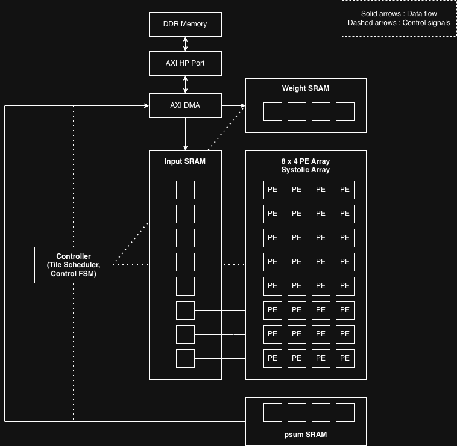
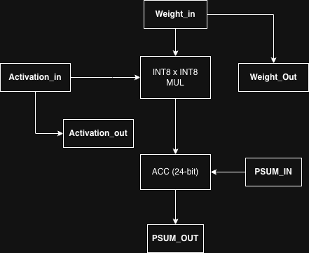

# FPGA INT8 AI Accelerator (MobileNetV2 on Zynq)

An FPGA-based systolic-array accelerator achieving **37.9× compute speedup**, with system-level analysis revealing **memory- and host-bound bottlenecks through Roofline modeling and runtime profiling**.

---

## Key Results

* **Average PE Utilization:** 88.25%

* **Pure Compute Speedup:** ~37.96× (vs CPU)

* **End-to-End Speedup:** ~2.45×

* **Key Observation:**
  Only ~22% of total runtime is spent on FPGA computation.

---

## Problem

Although FPGA accelerators can achieve high computational utilization,
their real-world performance is often constrained by system-level bottlenecks.

This project investigates:

* Why high PE utilization does not translate to end-to-end speedup
* How memory bandwidth limits accelerator performance
* How host-side overhead impacts system efficiency
* How to analyze these effects using runtime profiling and Roofline modeling

---

## Project Overview

This project designs an FPGA-based INT8 systolic-array accelerator targeting MobileNetV2 pointwise convolution.

It focuses on:

* Efficient acceleration of matrix-multiplication-like workloads
* HW–SW co-design on a Xilinx Zynq platform
* Quantization (PTQ, selective QAT) for deployment
* System-level performance analysis and bottleneck identification

The goal is not only to build an accelerator, but to understand the gap between compute efficiency and real system performance.

---

## Architecture

The accelerator is implemented on a Xilinx Zynq platform and consists of a systolic-array compute core with on-chip SRAM buffers.

* Systolic array for INT8 MAC operations
* On-chip SRAM buffers for data reuse
* AXI DMA for DDR ↔ PL data transfer
* Controller FSM for scheduling and execution



---

## Processing Element

Each processing element performs INT8 multiply–accumulate (MAC) operations:

* INT8 activation × INT8 weight
* Local accumulation of partial sums
* Data forwarding to neighboring PEs

The accumulator width was analyzed to ensure sufficient numerical precision during inference.



---

## Performance Analysis

Despite achieving high PE utilization (~88%), system-level performance gains were limited.

### Runtime Breakdown

* **FPGA Active Time:** ~22.04% of total runtime

Host-side overhead:

* **Numpy Layout Transformation:** ~58.82%
* **DMA Overhead:** ~30.55%
* **MMIO Control:** ~10.63%

This shows that performance is not only memory-bound but also **host-bound**.

---

### Roofline Analysis

* **Arithmetic Intensity:** ~7.46 MAC/Byte
* **Measured Bandwidth:** ~0.166 GB/s
* **Effective Bandwidth:** ~0.4 GB/s
* **Bandwidth Utilization:** ~41.6%

The system operates in a **memory-bound region**, where performance is constrained by memory bandwidth.

---

### Key Insight

> High compute utilization (~88%) and large compute speedup (~37×)
> do not translate to proportional end-to-end performance (~2.45×).

This demonstrates that:

* Memory bandwidth dominates performance
* Host-side overhead is a critical bottleneck
* System-level co-design is essential for real-world acceleration

---

## Optimization Process

The system was iteratively optimized through multiple stages:

1. **SW accumulation** – initial software-based accumulation
2. **HW accumulation** – moved accumulation into hardware
3. **Buffer allocation optimization** – reduced redundant memory access
4. **Transpose removal** – eliminated unnecessary data layout transformations
5. **DMA burst size exploration** – tested memory throughput improvements

The final implementation reflects the optimized configuration after removing transpose overhead.

---

## Repository Structure

```id="bnrrc2"
fpga-ai-accelerator-dev
├── rtl        # Verilog implementation
├── vivado     # FPGA design (excluded in public build)
├── notebooks  # optimization experiments
├── ml         # quantization experiments
├── analysis   # performance data and plots
├── scripts    # data processing
├── docs       # report and figures
```

---

## Target Platform

* Xilinx Zynq FPGA (PYNQ environment)
* MobileNetV2 INT8 inference

---

## Full Report

Detailed architecture, experiments, and performance analysis are available in:

[`docs/report.pdf`](docs/report.pdf)

---

## Engineering Challenges

Selected engineering challenges and solutions encountered during development are documented in:

[`docs/development/accelerator_development_log.md`](docs/development/accelerator_development_log.md)

---

## Summary

This project demonstrates that:

* High compute utilization (~88%) is achievable on FPGA accelerators
* However, end-to-end performance is limited by **memory bandwidth and host overhead**
* System-level analysis (Roofline + runtime profiling) is essential for real-world optimization

The work highlights the importance of **hardware–software co-design, memory-aware architecture design, and host-side optimization** in edge AI systems.
